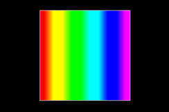

# Beatline - Gradient

I wanted a gradient material that uses color stops just like we have in CSS. I figured 6 color stops would cover the wildest combinations.
However, in order to make animating the gradients easier I added a width parameter to each color stop.

A gradient to the next color stop only takes place in the gap remaining between color stops after the solid color part for the width has been allocated.

This material needs more work.

